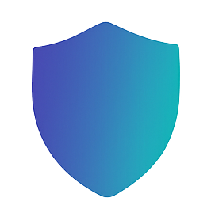

<p align="center">
  
  
  <h1 align="center">Custos</h1>
  
  <p align="center">
    The centralized authorization service.
  </p>
</p>

It acts as the **Policy Decision Point (PDP)** in our microservice architecture, managing all **authorization logic** based on roles and permissions across the system. Custos is responsible for answering one critical question:

> *"Is user X allowed to perform action Y on resource Z?"*

Custos abstracts the internal authorization engine (Casbin) behind a clean, versioned HTTP API, so that all other services (e.g. Vaulta, Quore, Linden Portal) can enforce authorization without needing to know how policies are defined or evaluated.

🧬 Naming

Custos (Latin): Guardian, protector, or watchman.

The name reflects the service’s purpose — to guard access to sensitive resources, and enforce the rules that govern trust in the Linden platform.

---

## 🔧 Core Responsibilities

- Centralize authorization decisions for all services.
- Enforce **role-based** and **resource-based access control**.
- Expose APIs to:
  - Check permissions
  - Assign and manage roles
  - Query permissions for UI display
- Serve as the source of truth for all access control logic and data.

---

## 🧠 Key Concepts

### Subjects
Users, identified by their Auth0 `sub` (e.g. `auth0|abc123`).

### Actions
Defined operations, such as `read`, `write`, `delete`, `create`, `manage`.

### Resources
Things users act on, e.g.:
- Projects (`project:{id}`)
- Accounts (`account:{id}`)
- Other domain entities

### Domains
Authorization domains (typically `account_id`) for scoping roles (multi-tenancy).

### Roles
Assigned per domain (e.g. viewer, editor, admin within an account). Roles map to permitted actions.

---

## 🛠️ Technology Stack

- **Python** / **FastAPI**
- **Casbin** as the policy engine
- **PostgreSQL** (via Casbin adapter) for persistent policy storage
- REST API (JSON over HTTP)

---

## 🧩 How It Fits

All other services in the Linden platform (Vaulta, Quore, etc.) delegate authorization checks to Custos via an HTTP call:

[Service] –> [Custos] –> [Casbin] –> allow/deny

Services are **not coupled** to Casbin or any policy logic — they just send requests to Custos like:

```json
POST /authorize
{
  "subject": "auth0|abc123",
  "action": "read",
  "resource": {
    "type": "project",
    "id": "project-xyz",
    "account_id": "account-123"
  }
}

Custos replies:

```json
{ "allowed": true }
```

## 📦 API Overview (v1)

| Method | Endpoint        | Description                                  |
|--------|------------------|----------------------------------------------|
| POST   | `/authorize`     | Evaluate whether a subject can perform an action on a resource |
| POST   | `/assign-role`   | Assign a role to a user within a specific domain (e.g., account) |
| DELETE | `/role`          | Remove a user's role assignment              |
| GET    | `/permissions`   | List all roles and domains associated with a user |
| GET    | `/who-can`       | (Optional) List users who can perform a given action on a resource |


## Auth

* Custos expects JWTs from Auth0 for all protected endpoints.
* The sub from the token is used to identify the subject.
* Admin endpoints (like assigning roles) require elevated privileges.
